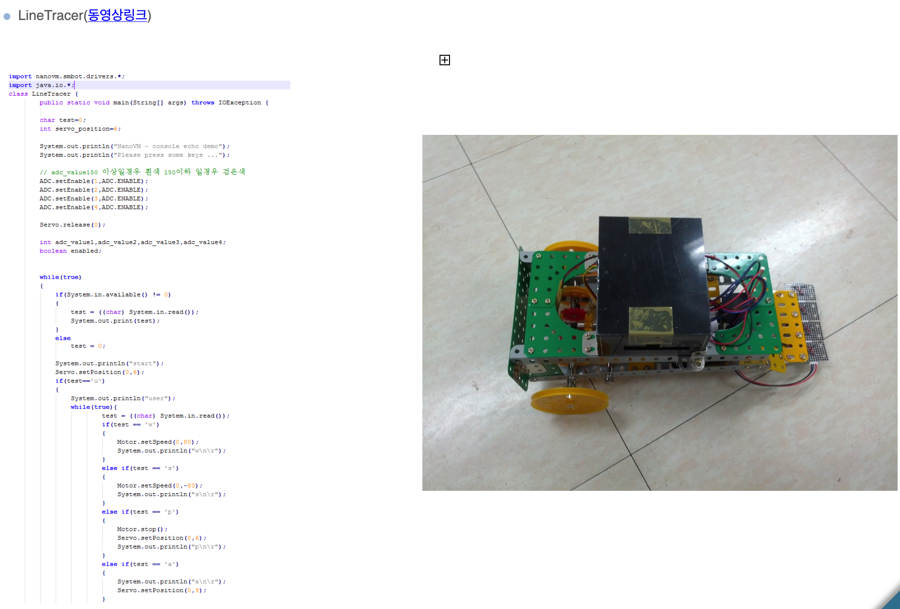

# nanoVM

## 교육용 ARM로봇의 자바기반 플랫폼

교육용 언어로 상대적으로 간단하고 구현이 쉬운 Python이 인기를 끌듯 Robot제어
및 프로그래밍 교육을를 C언어가 아닌 Java로 가능하도록 만든 프로젝트

> 오픈소스 JVM인 nanoVM을 기반으로 목적에 맞게 수정하여 개발.

과학상자 플랫폼을 이용해 레고와 같이 User(Kids)의 창의성에 따라 다양한 로봇 제작 가능.

## Demo

[데모 영상 링크](https://www.youtube.com/embed/ZzB3Fx-p530?feature=player_detailpage)

